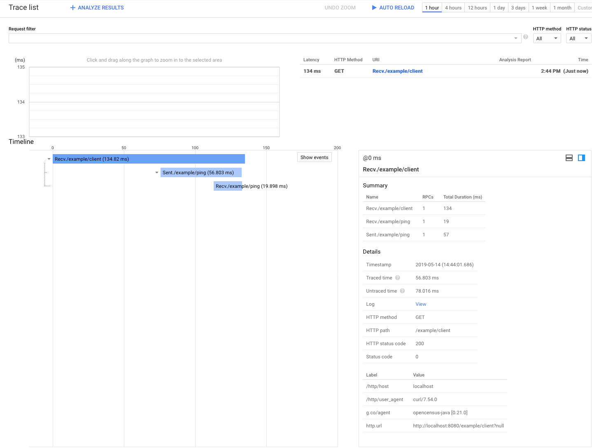
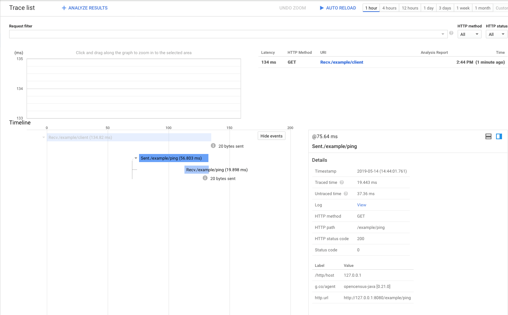

Dropwizard OpenCensus Bundle
============================

A bundle for tracing via OpenCensus from Dropwizard applications.

Dependency Info
---------------

```xml
        <dependency>
            <groupId>io.github.lusis.dropwizard</groupId>
            <artifactId>opencensus-core</artifactId>
            <version>1.1-SNAPSHOT</version>
        </dependency>
```

Server Usage
------------

Add `OpenCensusBundle` to your Application class:

```java
    @Override
    public void initialize(final Bootstrap<MyConfiguration> bootstrap) {
        bootstrap.addBundle(
                new OpenCensusBundle<ExampleConfiguration>() {
                    @Override
                    public OpenCensusFactory getOpenCensusFactory(ExampleConfiguration configuration) {
                        return configuration.getOpenCensusFactory();
                    }
                });
    }

```

Client Usage
------------
If you want to use an instrumented jersey client, you can as well via the opencensus-client package:

```xml
        <dependency>
            <groupId>io.github.lusis.dropwizard</groupId>
            <artifactId>opencensus-client</artifactId>
            <version>1.1-SNAPSHOT</version>
        </dependency>
```

```java
   Client client =
        new JerseyClientBuilder(environment)
            .withProvider(new TracingClientProvider().getFilter()) // or TracingClientProvider("b3")
            .build("traced-client");
```

Configuration
-------------

Out of the box, no configuration is required. The default is to not enable tracing.

If you want to configure options for development:

```yaml
opencensus:
  enabled: true
  exporters:
    - type: logging
  sampler:
    type: always
```

Potential production kinds of settings might be:

```yaml
opencensus:
  propagationFormat: b3
  isPublic: "true"
  enabled: true
  exporters:
    - type: logging # log traces
    - type: stackdriver # also send to stackdriver
  sampler:
    type: probability
    sampleRate: 0.25
```

OpenCensus supports multiple exporters so we expose that for you.
Valid `exporters` types are `default` (drops traces on the floor), `logging`, `stackdriver`.
Valid `sampler` types are `always`, `never`, `probability`.
The default probability `sampleRate` is `0.10`.

The bundle will apply tracing to all non-admin paths via the `OcHttpServletFilter`.

Below is a fully commented config:

```yaml
# by default, no configuration enables tracing for all paths but drops everything on the floor
opencensus:
  # see note about propagationFormat in README
  # propagationFormat: b3
  # see note about isPublic in README
  # Note that this is a string not a boolean
  # isPublic: "true"
  # set enabled to false to fully disable it
  #  enabled: false
  exporters:
    # options [logging, default, stackdriver]
    - type: logging
   # - type: stackdriver
      # projectId is used for the stackdriver exporter - optional
      # defaults are checked here: https://github.com/googleapis/google-cloud-java/blob/master/README.md#specifying-a-project-id
      #projectId:  test-project-1-XXXXXXXX
      # attributes are key/value strings applied as static attributes to all spans in StackDriver
      #attributes:
      #  project_name: ExampleApplication
  sampler:
    # options [never, always, probability]
    type: always
    # sampleRate is used for the probability sampler
    #sampleRate: 0.50
  # array of urls to trace - default is /*
  # paths:
  #  - "/example/ping"
  #  - "/example/client"
```

`propagationFormat`
-------------------

This setting defines which set of headers to send (in the case of a client) or read from (in the case of a server)
in order to enable distributed tracing across service boundaries.

This setting is ENTIRELY environment specific. The default for not only the `opencensus-java` libraries
but every other opencensus language implementation is the [w3c trace context](https://w3c.github.io/trace-context/).

It is worth noting the big ugly warning on that page stating that:

> Do not attempt to implement this version of the specification. Do not reference this version as authoritative in any way.

And yet.....

The exception to this is `opencensus-go` which uses the [`b3` implementation](https://github.com/apache/incubator-zipkin-b3-propagation)
which is used by zipkin, opentracing and other "OG" software in the tracing space.

What does this mean? I'm glad you asked....

Clients talking to services with DIFFERENT formats over HTTP (i.e. default java client talking to default golang server) will NOT create [Links](https://opencensus.io/tracing/span/link/) 
or have a [Parent Span](https://opencensus.io/tracing/span/parentspanid/).

This does NOT affect gRPC services as those use the `binary` format across all the language implementations.
It also does not affect passing a span context between function/methods in the within the same application "state" (i.e. single golang process or jvm instance)

The other gotcha with this setting is that, at least in the various server implementations across languages, is that it is global:

- in Java implementations, it's applied at the servlet container level for instance
- in Go implementations, it's applied to the handler on servers and transport on clients

Realistically, any server needs to opt into either B3 or TraceContext for distributed tracing across HTTP.

_None of this even gets into the format used when running on AppEngine talking to StackDriver_

For clients, this can be set at instantiation so you can have one client for calling `TraceContext` endpoints and another for calling `B3` endpoints.

In a perfect world, the server-side implementations would call a chain to check the headers and use the appropriate one that it supports (imho)

That leads us to `Public Endpoints`

`isPublic`
----------

This is the other setting that is environment specific except this ONLY applies to server endpoints and like `propagationFormat`, it's global.

In a nutshell, `isPublic` controls how a server interprets any trace headers it gets over HTTP.

If `isPublic` is false, the incoming request's traceID is set as the parent and spans generate by that endpoint will be children of that trace id.
If `isPublic` is true, the incoming request's trace id is set as a link. This will generate a new span with an attribute mentioning this link.

Being that this is, again, global to the servlet container in Java you need to know if your which way you want this configured.
General rule, if you're taking ANY public internet requests, set to to `"true"`. Otherwise leave it empty, which is a default of `"false"`.

You can read more about links [here](https://opencensus.io/tracing/span/link/).

As an alternative to this global requirement, you COULD leverage the `paths` setting and only enabled tracing on truly private endpoints.
 

Example Application
-------------------

This bundle includes a simple DropWizard application with two exposed paths:
- `/example/ping` - dumps the TraceConfig as plaintext
- `/example/headers` - dumps the request headers as JSON
- `/example/client` - this uses the instrumented jersey client to call `/example/headers` to show/test parent/child spans by default
   - optionally takes a `url` query parameter to call for testing cross-language interoperability

You can build and start the example application like so:

```
mvn clean package
java -jar opencensus-example/target/opencensus-example-<version>.jar server opencensus-example/config.yml
```

From another window, you can `curl http://localhost:8080/example/client`

In the window where you started the server you should see the trace data logged:

```
127.0.0.1 - - [13/May/2019:21:03:33 +0000] "GET /example/ping HTTP/1.1" 200 20 "-" "dropwizard-opencensus-example (instrumented-http-client)" 21
0:0:0:0:0:0:0:1 - - [13/May/2019:21:03:33 +0000] "GET /example/client HTTP/1.1" 200 20 "-" "curl/7.54.0" 156
INFO  [2019-05-13 21:03:35,331] io.opencensus.exporter.trace.logging.LoggingTraceExporter: SpanData{context=SpanContext{traceId=TraceId{traceId=c34898bd2a5a00cec1aa00ff5b41f14f}, spanId=SpanId{spanId=70bdcb2bdb09e7ce}, traceOptions=TraceOptions{sampled=true}}, parentSpanId=SpanId{spanId=0e3c6731e1853260}, hasRemoteParent=true, name=/example/ping, kind=SERVER, startTimestamp=Timestamp{seconds=1557781413, nanos=933000720}, attributes=Attributes{attributeMap={http.status_code=AttributeValueLong{longValue=200}, http.user_agent=AttributeValueString{stringValue=dropwizard-opencensus-example (instrumented-http-client)}, http.path=AttributeValueString{stringValue=/example/ping}, http.url=AttributeValueString{stringValue=http://127.0.0.1:8080/example/ping?null}, http.method=AttributeValueString{stringValue=GET}, http.host=AttributeValueString{stringValue=127.0.0.1}}, droppedAttributesCount=0}, annotations=TimedEvents{events=[], droppedEventsCount=0}, messageEvents=TimedEvents{events=[TimedEvent{timestamp=Timestamp{seconds=1557781413, nanos=947603892}, event=MessageEvent{type=SENT, messageId=1, uncompressedMessageSize=20, compressedMessageSize=0}}], droppedEventsCount=0}, links=Links{links=[], droppedLinksCount=0}, childSpanCount=0, status=Status{canonicalCode=OK, description=null}, endTimestamp=Timestamp{seconds=1557781413, nanos=952120465}}
INFO  [2019-05-13 21:03:35,331] io.opencensus.exporter.trace.logging.LoggingTraceExporter: SpanData{context=SpanContext{traceId=TraceId{traceId=c34898bd2a5a00cec1aa00ff5b41f14f}, spanId=SpanId{spanId=0e3c6731e1853260}, traceOptions=TraceOptions{sampled=true}}, parentSpanId=SpanId{spanId=61916035e34a579e}, hasRemoteParent=false, name=/example/ping, kind=CLIENT, startTimestamp=Timestamp{seconds=1557781413, nanos=873125449}, attributes=Attributes{attributeMap={http.path=AttributeValueString{stringValue=/example/ping}, http.url=AttributeValueString{stringValue=http://127.0.0.1:8080/example/ping}, http.status_code=AttributeValueLong{longValue=200}, http.method=AttributeValueString{stringValue=GET}, http.host=AttributeValueString{stringValue=127.0.0.1}}, droppedAttributesCount=0}, annotations=TimedEvents{events=[], droppedEventsCount=0}, messageEvents=TimedEvents{events=[], droppedEventsCount=0}, links=Links{links=[], droppedLinksCount=0}, childSpanCount=0, status=Status{canonicalCode=OK, description=null}, endTimestamp=Timestamp{seconds=1557781413, nanos=952089000}}
INFO  [2019-05-13 21:03:35,331] io.opencensus.exporter.trace.logging.LoggingTraceExporter: SpanData{context=SpanContext{traceId=TraceId{traceId=c34898bd2a5a00cec1aa00ff5b41f14f}, spanId=SpanId{spanId=61916035e34a579e}, traceOptions=TraceOptions{sampled=true}}, parentSpanId=null, hasRemoteParent=null, name=/example/client, kind=SERVER, startTimestamp=Timestamp{seconds=1557781413, nanos=810006345}, attributes=Attributes{attributeMap={http.status_code=AttributeValueLong{longValue=200}, http.user_agent=AttributeValueString{stringValue=curl/7.54.0}, http.path=AttributeValueString{stringValue=/example/client}, http.url=AttributeValueString{stringValue=http://localhost:8080/example/client?null}, http.method=AttributeValueString{stringValue=GET}, http.host=AttributeValueString{stringValue=localhost}}, droppedAttributesCount=0}, annotations=TimedEvents{events=[], droppedEventsCount=0}, messageEvents=TimedEvents{events=[TimedEvent{timestamp=Timestamp{seconds=1557781413, nanos=954954280}, event=MessageEvent{type=SENT, messageId=1, uncompressedMessageSize=20, compressedMessageSize=0}}], droppedEventsCount=0}, links=Links{links=[], droppedLinksCount=0}, childSpanCount=1, status=Status{canonicalCode=OK, description=null}, endTimestamp=Timestamp{seconds=1557781413, nanos=955030494}}
```

If you look closely, the span flows look like this:

- Initial request to `/example/client` has spanId `61916035e34a579e`
- client calls `http://localhost:8080/example/ping` with spanId `0e3c6731e1853260` and parent spanId `61916035e34a579e`
- request to `/example/ping` has spanId `70bdcb2bdb09e7ce` with parent spanId `0e3c6731e1853260`

This is more easily visualized when using the stackdriver exporter



If you click on the `Sent` span you can see the instrumented Jersey client trace


TODO
----

There's a lot to do here to make this production ready:

- [ ] Clean up the code
- [X] Flesh out tests
- [X] Expose exporters OTHER than logging such as StackDriver
- [X] Expose traced routes in configuration
- [X] Actually publish this to central

Contributing
------------

I've not written Java in a very long time and in the process of writing this I had to learn DropWizard bundles, Jackson and some other things.
I would GREATLY welcome any and all help including turning this project over to someone else.
This was written as an MVP to prove out something for work.

I think there's good bones here in terms of concepts.